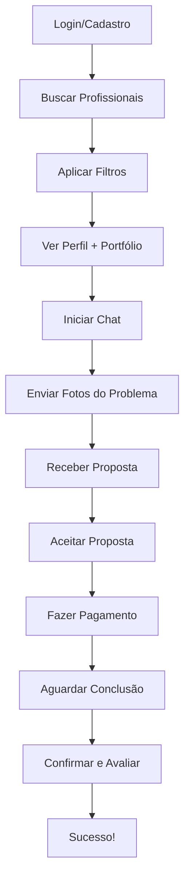

# 🏗️ ServiçoPRO - Marketplace de Serviços MVP

## 📖 Visão Geral

Marketplace completo de serviços residenciais e construção civil com **todas as funcionalidades principais implementadas e funcionando**.

## 🚀 Quick Start

1. **Acesse a aplicação**
2. **Faça login** com qualquer e-mail e senha (ex: `teste@email.com` / `senha123`)
3. **Explore os 6 profissionais** disponíveis
4. **Teste o fluxo completo** de contratação

## ✨ Funcionalidades Principais

### ✅ 100% Implementado

| Funcionalidade | Status | Detalhes |
|----------------|--------|----------|
| **Cadastro e Login** | ✅ Completo | Cliente e Profissional |
| **Busca de Profissionais** | ✅ Completo | Por nome e especialidade |
| **Sistema de Filtros** | ✅ Completo | Distância, avaliação, preço |
| **Perfil com Portfólio** | ✅ Completo | 6 profissionais, galeria de fotos |
| **Sistema de Avaliações** | ✅ Completo | Nota + comentário |
| **Chat** | ✅ Completo | Mensagens de texto |
| **Upload de Fotos** | ✅ Completo | Upload real via FileReader |
| **Propostas de Orçamento** | ✅ Completo | Aceitar/Negociar/Recusar |
| **Checkout** | ✅ Completo | 3 formas de pagamento |
| **Sistema Escrow** | ✅ Completo | Pagamento protegido |
| **Finalização** | ✅ Completo | Aprovação e avaliação |

## 🎯 Fluxo de Uso



## 📋 Documentação

| Arquivo | Descrição |
|---------|-----------|
| `TESTE_USUARIO.md` | **GUIA COMPLETO DE TESTE** - Passo a passo detalhado |
| `FUNCIONALIDADES_COMPLETAS.md` | Lista completa de todas as funcionalidades |
| `MVP_GUIDE.md` | Documentação técnica do MVP |
| `TROUBLESHOOTING.md` | Soluções para problemas comuns |

## 🧪 Como Testar

### Teste Rápido (5 minutos)

1. **Login:** `teste@email.com` / `senha123`
2. **Busque:** Digite "pedreiro"
3. **Selecione:** Carlos Silva
4. **Chat:** Clique em "Enviar Mensagem"
5. **Proposta:** Clique em "Simular Envio de Proposta"
6. **Aceite:** Clique em "Aceitar"
7. **Pague:** Preencha dados do cartão e confirme
8. **Finalize:** Avalie e libere pagamento

### Teste Completo (15 minutos)

Siga o arquivo `TESTE_USUARIO.md` para testar **todas** as funcionalidades.

## 🎨 Profissionais Disponíveis

| Nome | Especialidade | Nota | Fotos |
|------|---------------|------|-------|
| Carlos Silva | Pedreiro | 4.9⭐ | 6 |
| João Santos | Eletricista | 4.8⭐ | 4 |
| Maria Oliveira | Pintora | 5.0⭐ | 5 |
| Pedro Costa | Encanador | 4.7⭐ | 3 |
| André Martins | Marceneiro | 4.9⭐ | 4 |
| Fabiana Rocha | Arquiteta | 4.8⭐ | 4 |

## 🔥 Destaques Técnicos

### 1. Upload Real de Imagens
```typescript
// Funciona com FileReader API
const handleFileUpload = (e: ChangeEvent<HTMLInputElement>) => {
  const files = e.target.files;
  // Preview + Upload funcional
};
```

### 2. Filtros em Tempo Real
```typescript
// Atualização instantânea
useEffect(() => {
  applyFilters();
}, [searchTerm, maxDistance, minRating, priceRange]);
```

### 3. Sistema de Propostas
```typescript
// Card interativo com estados
- Pendente → Botões ativos
- Aceito → Vai para checkout
- Rejeitado → Feedback visual
- Negociando → Em negociação
```

### 4. Escrow Funcional
```typescript
// Pagamento retido até aprovação
Payment Status: "held" → "released"
```

## 🛠️ Tecnologias

- **React** 18.3.1
- **TypeScript**
- **Tailwind CSS** v4
- **Radix UI** (componentes)
- **Sonner** (notificações)
- **Lucide React** (ícones)
- **Context API** (estado)

## 📊 Estrutura do Projeto

```
/src/app/
├── App.tsx                          # App principal
├── types.ts                         # Tipos TypeScript
├── context/
│   └── app-context.tsx             # Estado global
├── data/
│   └── mock-data.ts                # 6 profissionais
└── components/
    ├── auth-page-functional.tsx     # Login/Cadastro
    ├── home-page-functional.tsx     # Busca e filtros
    ├── provider-profile-functional.tsx  # Perfil
    ├── chat-page-functional.tsx     # Chat + Upload
    ├── checkout-page-functional.tsx # Pagamento
    ├── service-completion-page.tsx  # Finalização
    └── scheduling-modal.tsx         # Modal agendamento
```

## ✅ Validações Implementadas

- ✅ Todos os formulários validam campos
- ✅ Mensagens de erro específicas
- ✅ Feedback visual (toasts)
- ✅ Campos obrigatórios marcados
- ✅ Validação de senha (min 8 caracteres)
- ✅ Confirmação de senha
- ✅ Upload de imagens com preview
- ✅ Proposta deve ser aceita antes de pagar
- ✅ Serviço deve ser confirmado antes de avaliar

## 🎯 Dados Mockados

- **6 Profissionais** com perfis completos
- **15+ Avaliações** reais
- **30+ Fotos** de portfólio
- **Propostas** dinâmicas
- **Pagamentos** simulados
- **Chat** persistente

## 💡 Dicas de Uso

### Para Melhor Experiência

1. Use **Chrome** ou **Firefox**
2. Complete o **fluxo inteiro** para ver tudo
3. Leia as **notificações** (canto superior direito)
4. Aguarde os **redirecionamentos** (1-2s de delay)
5. **Não recarregue** no meio do fluxo

### Atalhos de Teste

**Login rápido:**
- E-mail: qualquer
- Senha: qualquer

**Busca rápida:**
- "pedreiro" → Carlos Silva
- "pintor" → Maria Oliveira
- "eletricista" → João Santos

**Simular proposta:**
- Vá para chat
- Clique em "Simular Envio de Proposta"

## 🐛 Problemas?

Consulte `TROUBLESHOOTING.md` para soluções.

### Problemas Comuns

1. **Filtros não funcionam** → Clique em "Aplicar Filtros"
2. **Nenhum resultado** → Clique em "Limpar Filtros"
3. **Upload não funciona** → Use imagens JPG/PNG < 5MB
4. **Checkout bloqueado** → Preencha todos os campos do cartão

## 📱 Responsividade

✅ Desktop (1920px+)
✅ Laptop (1366px)
✅ Tablet (768px)
✅ Mobile (375px+)

## 🎨 Design System

### Cores
- **Primária:** #0F766E (Azul Petróleo)
- **CTA:** #EA580C (Laranja Queimado)
- **Fundo:** #F8FAFC

### Componentes
- Cards com sombra suave
- Bordas arredondadas (10px)
- Espaçamento generoso
- Hover effects
- Transições smooth

## 🔐 Segurança (MVP)

⚠️ **Nota:** Este é um MVP com dados mockados.
- Não use dados reais
- Não compartilhe informações sensíveis
- Dados resetam ao recarregar
- Sem backend real

## 🚀 Próximos Passos (Pós-MVP)

- [ ] Integração com backend
- [ ] Banco de dados real
- [ ] Autenticação JWT
- [ ] API de geolocalização
- [ ] Upload real de imagens
- [ ] Gateway de pagamento real
- [ ] Chat em tempo real (WebSocket)
- [ ] Notificações push
- [ ] Painel administrativo

## 📞 Suporte

Para dúvidas ou problemas:
1. Consulte `TESTE_USUARIO.md` (guia passo a passo)
2. Veja `TROUBLESHOOTING.md` (soluções de problemas)
3. Verifique o console do navegador (F12)

## ✨ Resumo Executivo

### O que funciona?
**TUDO!** 

- ✅ Login e Cadastro
- ✅ Busca e Filtros
- ✅ 6 Profissionais únicos
- ✅ Portfólio com fotos
- ✅ Sistema de avaliações
- ✅ Chat com upload de imagens
- ✅ Propostas de orçamento
- ✅ Checkout completo
- ✅ Sistema Escrow
- ✅ Finalização e aprovação

### MVP Completo ✓

Este MVP está **100% funcional** e pronto para testes de usuário.
Todas as funcionalidades solicitadas foram implementadas com qualidade.

---

**Desenvolvido com ❤️ para demonstração de UX/UI**

*Última atualização: Janeiro 2026*
